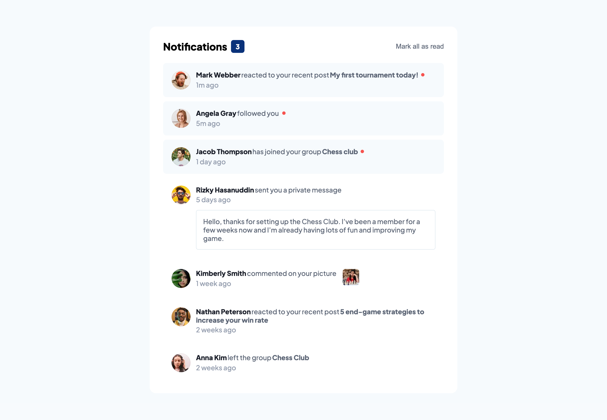
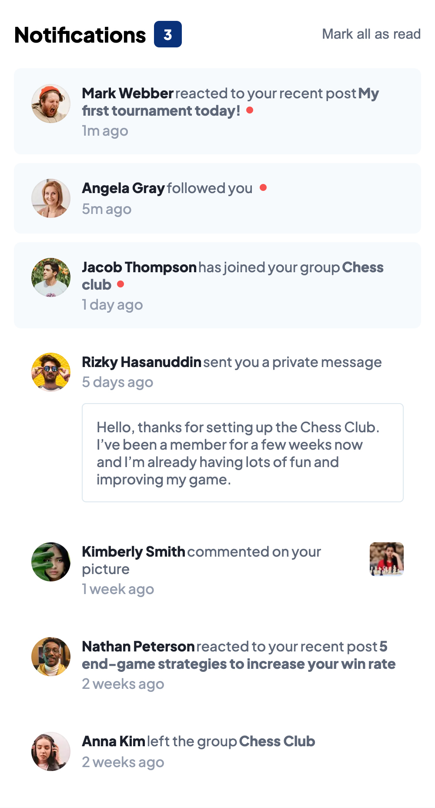

# Frontend Mentor - Notifications page solution

This is a solution to the [Notifications page challenge on Frontend Mentor](https://www.frontendmentor.io/challenges/notifications-page-DqK5QAmKbC). Frontend Mentor challenges help you improve your coding skills by building realistic projects.

## Table of contents

- [Overview](#overview)
  - [The challenge](#the-challenge)
  - [Screenshot](#screenshot)
  - [Links](#links)
- [My process](#my-process)
  - [Built with](#built-with)
  - [What I learned](#what-i-learned)
  - [Continued development](#continued-development)
  - [Useful resources](#useful-resources)
- [Author](#author)
- [Acknowledgments](#acknowledgments)

## Overview

### The challenge

Users should be able to:

- Distinguish between "unread" and "read" notifications
- Select "Mark all as read" to toggle the visual state of the unread notifications and set the number of unread messages to zero
- View the optimal layout for the interface depending on their device's screen size
- See hover and focus states for all interactive elements on the page

### Screenshot




### Links

- Solution URL: [Github](https://github.com/delroscol98/notifications-page)
- Live Site URL: [Netlify](https://main--majestic-dolphin-c87936.netlify.app/)

## My process

### Built with

- Semantic HTML5 markup
- CSS custom properties
- Flexbox
- CSS Grid
- Mobile-first workflow
- [React](https://reactjs.org/) - JS library

### What I learned

In this project I practiced using the Array.map() function to render multiple components. Below is the JS code used to update the state of the notifications from "unread" to "read.

```js
const [notifications, setNotifications] = useState(initialNotifications);
const numReadNotifications = notifications.filter(
  (notification) => notification.read === false
);

const readAllNotifications = () => {
  setNotifications((notifications) =>
    notifications.map((notification) => {
      return { ...notification, read: true };
    })
  );
};

const setNotificationsHandler = (selected) => {
  setNotifications((notifications) => {
    return notifications.map((notification) => {
      return selected?.name === notification.name
        ? { ...notification, read: true }
        : notification;
    });
  });
};
```

### Continued development

This project was a practice for to become more familiar with state. Moving forward, I'll be looking at more complex useState cases and more complex React hooks.

## Author

- Frontend Mentor - [@delroscol98](https://www.frontendmentor.io/profile/delroscol98)
